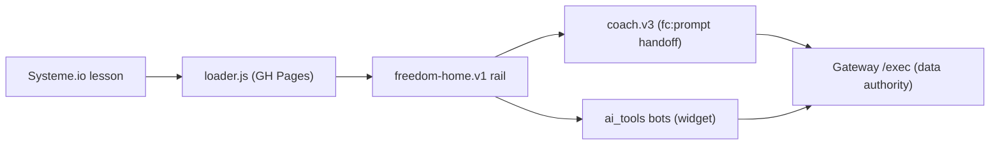

# 📊 Freedom Tracker (student rail) Dashboard

*Snapshot 2026-07-19 — refresh by invoking `/dave-core:dashboard` in this repo.*

**Mission:** the student-facing Freedom experience — tracker, AI coach, and the one-page **Freedom Home** rail — served into Systeme.io lessons from GitHub Pages, grandpa-simple by doctrine.

## Headline

Freedom Home build **phases 5–9.8 DONE** — 9.8 (2026-07-19) gave the rail the **ChatNode-style mobile fullscreen takeover** (phone = whole screen; desktop unchanged; tools render inline in the rail via the widget's new `data-inline`). Next milestone is **Dave's phone + desktop live test** (plan phase 10).

## State board

| Lens | State | Where |
|---|---|---|
| Loader chain (v7 + #freedom-home route) | 🟢 live via Pages | [loader.v7.js](loader.v7.js) |
| Coach v3 (fc:prompt events, send-to-tool) | 🟢 built | [coach.v3.js](coach.v3.js) |
| Freedom Home one-page rail | 🟡 built + mock-harness green, awaiting live test | [freedom-home.v1.js](freedom-home.v1.js) |
| Mobile fullscreen takeover (9.8) | 🟢 **proven on Dave's iPhone on the real lesson** (2026-07-20); round-1 CSS fixes shipped (widget text color bleed, header wrap) — re-verify on phone after Pages cache | [test_home_lesson.html](test_home_lesson.html) |
| 9.7 polish (auto-log chips w/ undo, de-trackered copy) | 🟢 done | git log |
| Test harnesses | 🟢 in repo | [test_coach_home.html](test_coach_home.html) · [test_home.html](test_home.html) |

## Progress

**Done:** phases 5–9.8 of the Freedom Home plan (shell, wizard, power-hour, daily, progress, coach persistence, session resume, auto-log chips, de-trackered voice, mobile fullscreen takeover).

- [ ] Phase 10 — Dave live test on a real lesson
- [ ] Phase 11 — September model bump (scheduled; before Gemini 2.5-Flash's Oct 16 deprecation)

## ✍️ Waiting on Dave

1. **Phase-10 live test** — run Freedom Home in a real Systeme lesson, note friction, green-light wider rollout.

## 🔌 Connections

| Surface | Detail |
|---|---|
| Hosting | GitHub Pages (this repo) — Pages cache ~10 min after `gc` push |
| Embedded in | Systeme.io lessons (Freedom course) |
| Data authority | [freedom_tracker_gateway](https://github.com/dfonvielle/freedom_tracker_gateway) /exec |
| Bots | [ai_tools](https://github.com/dfonvielle/ai_tools) via the public widget |
| Student sheets | per-student tracker sheets from Dave's master template — ⚠️ template URL NEEDED in `mission_control/data/sheets.json` |
| Google Apps Script | none in this repo (student sheets carry their own script; server logic lives in the Gateway) |

## 🤖 AI leverage

*Seeded from the 2026-07-19 fresh-eyes burn ([opus](https://github.com/dfonvielle/mission_control/blob/main/ai_research/fresh_eyes/freedom-tracker_opus.md) · [gpt-4.1](https://github.com/dfonvielle/mission_control/blob/main/ai_research/fresh_eyes/freedom-tracker_gpt41.md)).*

- **End-of-session reflection reframes:** raw log → 2-sentence "here's what you actually accomplished" — turns friction logging into dopamine.
- **Withdrawal-helper triage:** classify severity of a struggle flag, suggest ONE playbook action — coaching-adjacent without Dave present.
- **Weekly digest:** a week of sessions → narrative momentum email; retention hook that writes itself.

## 📚 Library

Plan: `~/Desktop/coding_projects/PLAN_freedom_home_and_providers.md` (local — coding_projects root is not a repo) · doctrine: `~/Desktop/coding_projects/DRUNK_GRANDPA_STRATEGY.md` (local) · coach eval journeys: [gateway ai_research](https://github.com/dfonvielle/freedom_tracker_gateway/tree/main/ai_research)

*🚀 Part of [Mission Control](https://github.com/dfonvielle/mission_control/blob/main/DASHBOARD.md) — the all-projects dashboard.*
