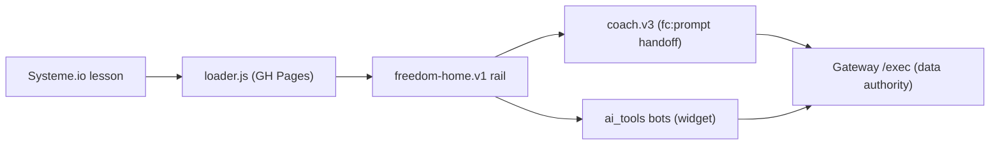

# 📊 Freedom Tracker (student rail) Dashboard

*Snapshot 2026-07-21 (round 16) — refresh by invoking `/dave-core:dashboard` in this repo.*

**Mission:** the student-facing Freedom experience — tracker, AI coach, and the one-page **Freedom Home** rail (Dave's name: **Freedom Accelerator**) — served into Systeme.io lessons from GitHub Pages, grandpa-simple by doctrine.

## Headline

**Rounds 13 + 14 shipped 2026-07-21** — the program has its **third act**, end to end. Round 13: **More help & tools** (SYBR explainer with the quit-date answer + the named road, Power Hour revisits, direct tool opens), progress See↔Hide toggle, **Gateway default-project hardening** (Day-14 closed at account level), and the testability machinery (`fh preview`, the State Map below, doctrine §4.9). Round 14: **the milestone** — the Gateway watcher notices 3 logged days of Easy ≥7 + Enjoyable ≥7 and the rail raises the gold "⭐ Something worth seeing" card itself (grandpa never self-assesses); the **No-Brainer Life-Changing Decision room** (decide from ease; slips are rewiring material; two-second maintenance preview); deciding logs the milestone (registry JSON, works past the edit window), the ⭐ line **leads the progress story**, the card never returns, and the coach carries the decision as background context with slip-framing rules (never brings it up unprompted, never frames recurrence as failure — nothing resets). "Not yet" = 7-day snooze. Full journey + snooze + decided-state harness-verified; zero console errors. **Maintenance mode (tier 3) remains deliberately unbuilt** — designed after Dave's own milestone walk. **Round 15 (same day):** the page speaks a color language now — **gold = payoff** ("See my progress" joins the milestone family; blue = do, green = talk, gray = optional); desktop coach got its **"Your Freedom AI Coach"** identity back (hidden in the phone sheet where the bar says it); the explainer merged Dave's original SYBR-101 teaching devices (**3 named ingredients, the kiss proof, real-vs-imagined, bar-not-lake**) + Freedom Experiments with the 2-second example + time honesty + the **Freedom Proof Sprint** framing, and gained the **minplan revisit link** (the interactive teacher — 47 method mentions); **Withdrawal Helper** joined More-help with its medical-supervision safety line (was Day-1-only); the progress view teaches experiments in its **empty state** and names the **week-one proof** (Days 7–9: "You are not powerless"); Day 0 links the explainer its checkbox always presumed. **Round 16 (same day, off Dave's platform audit):** verdict — no unintended desktop/mobile divergence (his finds were state-dependent); the Gateway now branches per surface via `home:true` so **paste/tap mechanics language can never reach the Accelerator** (standalone lessons keep theirs); removal requests are legit ("their call, always" replace proposals); the chip family speaks ONE category language — **"Saving a rewiring opportunity…" → "Saved as a rewiring opportunity ✓ — 'their words'" → "Ask me anytime what's been challenging, and we'll pick a moment to rewire"** (own-words quotes untouchable); and the **wait-tip** turns the first model round trip into a planted seed ("…what would a two-second Freedom Experiment look like today?"). Next: **Dave's live walk of rounds 13–16** (`fh preview` forces everything), then humans.

## State board

| Lens | State | Where |
|---|---|---|
| Loader chain (v7 + #freedom-home route) | 🟢 live via Pages | [loader.v7.js](loader.v7.js) |
| Coach v3 (fc:prompt events, send-to-tool) | 🟢 built | [coach.v3.js](coach.v3.js) |
| Freedom Home one-page rail | 🟡 built + mock-harness green, awaiting live test | [freedom-home.v1.js](freedom-home.v1.js) |
| Mobile fullscreen takeover (9.8) | 🟢 **proven on Dave's iPhone** (2026-07-20); rounds 2–4 shipped same-day: tools popup fullscreen OVER the rail, minimized rail = hint card, one-bubble invariant, coach fullscreen sheet (round-4 fc-scroll fix: composer pinned, help never crushed) | [test_home_lesson.html](test_home_lesson.html) |
| Grandpa polish 9.9 (rounds 5–9) | 🟢 shipped 2026-07-20: rounds 5–8 (greeting experiments, handoff diet, goal box, day-rollover tz, one-line header) + round 9 (two-door coach — Recommend removed, "Target what's challenging today →" primary); provider outage resolved (Dave set AI_PROVIDER=openrouter) | plan doc 9.9 notes |
| **Round 10 — chrome + exclusivity + handoff revert** | 🟢 shipped 2026-07-20 evening, harness-verified desktop+375: solid "Freedom Accelerator" bar (floating – gone, labeled ↻ Refresh back), one-line goal box + step-1 "My moment", coach head de-duped ("Your Freedom AI Coach" sheet bar; Day · Refresh · picker line), chat hint = composer label, doors exclusive + "Start over with the freedom coach", coachHelpMenu **prefetched** (instant panel), warm greeting deleted (prompt lands visibly + "— no questions." tail, /fear/i-gated), step-1 get-help preloads minplan with the goal line on fresh sessions; **bh_rbf Screen-1 no-questions fast-track added in ai_tools (was promised in greeting, implemented nowhere) — proven in harness (Screen 2 skipped), promoted LIVE** | plan doc 9.9 round 10 |
| 9.7 polish (auto-log chips w/ undo, de-trackered copy) | 🟢 done | git log |
| Test harnesses | 🟢 in repo | [test_coach_home.html](test_coach_home.html) · [test_home.html](test_home.html) |

## Progress

**Done:** phases 5–9.8 + polish rounds 5–10 of the Freedom Home plan (shell, wizard, power-hour, daily, progress, coach persistence, session resume, auto-log chips, de-trackered voice, mobile fullscreen takeover, two-door coach, round-10 chrome/exclusivity/handoff).

- [ ] Phase 10 — Dave live test on a real lesson (now = walking round 10)
- [ ] Phase 11 — September model bump (scheduled; before Gemini 2.5-Flash's Oct 16 deprecation)

## ✍️ Waiting on Dave

1. **Walk rounds 13–16 live** (Pages ~10 min; hard-refresh): progress toggle, **More help & tools** (read the explainer as YOUR method voice — flag any wording), and the milestone journey via `fh preview` → **milestone** scenario (the gold card → decision room → decide → ⭐ in progress; also the **decided** scenario). Author-review the milestone/decision copy especially — it's the method's biggest moment.
2. Your REAL account will show the gold card once your own scores hold 7+/7+ for three logged days — that's the lived walk that will teach us maintenance mode (tier 3, deliberately unbuilt).
3. If any wording looks old, check the Gateway **UI Copy tab** — sheet cells override code copy; clear stale cells.

## 🗺 State Map — every conditional, its trigger, and how to summon it

*Run `fh preview` (desktop harness) or `fh preview phone` (fullscreen lesson) — the buttons across the top force scenarios; the seeds below force the rest. **Rule (doctrine §4.9): no conditional ships without a row here + a way to force it.***

| State | Trigger (real life) | What the student sees | Force it |
|---|---|---|---|
| Setup wizard | project setup stage < 4 | 4-step "Welcome! Let's set up" | `?s=wizard` (clear `ag_fh_pin_v1` first) |
| **Wizard guard retry** | wizard-shaped state on an account that ever finished setup, no explicit pick | loading shell → one `fresh=true` re-pull → wizard only if server insists twice | visit `?s=day5` (writes pin), then `?s=wizard`; mock log shows the double state call |
| Crossed-midnight fresh | cached snapshot from a previous local date | instant paint, then forced-fresh background refresh | edit `ag_fh_cache_v1`'s `today` to yesterday, reload |
| Day 0 / Power Hour / Day-1 done | currentDay ≤ 1 | PH sequence, pips, celebrate | `?s=day1_fresh`, `?s=day1_scores` |
| Daily rail | day ≥ 2, stage 4 | the three-step rhythm | `?s=day5` |
| Resume button | today's session has a real student turn | "Continue where you left off with the {tool} →" | open a tool, send anything, reload |
| **Fresh-start ready card** | ready card while a live session exists | "Start a fresh rewiring session →" + wrap-up note; opening rotates the session key | use a tool, then run the guided flow |
| Back-to-session | any ready card after opening | live "Back to my rewiring session →" (never re-sends) | open any ready card |
| Conversation mode | student sent anything, no ready card | doors stand down, "Send a message…", Start-over shows | type to the coach |
| **Typed saving chips** | coach reply carries a save proposal | "Saving a rewiring opportunity…" → "Saved as a rewiring opportunity ✓ — 'their words'" + payoff + Undo (when restorable) | `?s=day5`, send a message containing "challenge" (700ms slowed save makes the verb visible) |
| **Wait-tip** | first model reply of a freshly mounted daily tool | muted line inside the typing bubble: "…two-second Freedom Experiment…"; gone on reply, never repeats | `?s=day5` → Simulate coach handoff (RBF) |
| Guided flow | "Target what's challenging today →" | composer hides, instant feelings panel (prefetched) | tap it |
| Ready-card end state | prompt built (either door) | card + See-or-edit + Start-over ONLY | finish the guided flow |
| Progress nudge | today not logged | "These numbers are from Day N — log today's…" | `?s=day9` → See my progress |
| Progress toggle (GOLD button) | tap | table + wins + **Freedom Experiments** + tell-your-coach line; label flips to "Hide my progress" | `?s=day9` |
| **Freedom Proof headline** | Days 7–9 with any positive movement | "That is your Freedom Proof… You are not powerless" leads the progress view | `?s=day9` |
| **Exps empty-state teach** | progress open, zero experiments logged | "try delaying your behavior even 2 seconds today" | `?s=day9` (day9 mock has no exps; `?s=milestone` has the full stack) |
| More help & tools | tap (ships collapsed) | explainer link, PH revisits, direct tools incl. **Withdrawal Helper** + medical-supervision safety line | any daily scenario |
| How-this-works card | link in More help (also on Day 0) | 2-min SYBR story (3 ingredients, kiss, real-vs-imagined, bar-not-lake) + Freedom Experiments + quit-date answer + Proof-Sprint road + ask-coach bridge + minplan revisit (Day 2+) | More help → the link |
| Fullscreen takeover / hint | phone width | "Freedom Accelerator" bar; minimized = hint card + bubble | `fh preview phone` |
| Coach sheet | phone, "Talk to your coach →" | fullscreen sheet, "Your Freedom AI Coach" bar | `fh preview phone` |
| Widget minimized note | tool popup minimized | "Your {tool} session is open — tap the blue chat bubble…" | phone: minimize an open tool |
| **Milestone card** | 3 most recent LOGGED score days all Easy ≥7 AND Enjoyable ≥7, no decision, not snoozed | gold "⭐ Something worth seeing" card between step 3 and progress; "Not yet" = 7-day snooze | `?s=milestone` |
| **Decision room + logged decision** | "Tell me about the No-Brainer Decision →" | decide-from-ease copy, slips-are-rewiring note, "I've made my decision" → saved; card never returns; ⭐ line leads the progress story; coach knows (background only) | `?s=milestone` → walk it; `?s=decided` = already-decided state |
| Setting-up poll | fresh buyer beat the webhook | "Setting up your tracker…" + auto-retry | `?s=settingup` |
| Multi-project picker | > 1 projects | dropdown in the one-line header | `?s=multi` |
| Gateway default pick (server) | state call with no projectId | finished project always beats a newer blank one | node-eval test in round-13 notes; blank never defaults |

## 🔌 Connections

| Surface | Detail |
|---|---|
| Hosting | GitHub Pages (this repo) — Pages cache ~10 min after `gc` push |
| Embedded in | Systeme.io lessons (Freedom course) |
| Data authority | [freedom_tracker_gateway](https://github.com/dfonvielle/freedom_tracker_gateway) /exec |
| Bots | [ai_tools](https://github.com/dfonvielle/ai_tools) via the public widget |
| Data | all student data lives in the [Gateway's](https://github.com/dfonvielle/freedom_tracker_gateway) authority sheet — this repo touches no spreadsheet directly |
| Google Apps Script | **none — verified 2026-07-20** (zero GAS code; pure browser JS calling the Gateway's /exec) |

## 🤖 AI leverage

*Seeded from the 2026-07-19 fresh-eyes burn ([opus](https://github.com/dfonvielle/mission_control/blob/main/ai_research/fresh_eyes/freedom-tracker_opus.md) · [gpt-4.1](https://github.com/dfonvielle/mission_control/blob/main/ai_research/fresh_eyes/freedom-tracker_gpt41.md)).*

- **End-of-session reflection reframes:** raw log → 2-sentence "here's what you actually accomplished" — turns friction logging into dopamine.
- **Withdrawal-helper triage:** classify severity of a struggle flag, suggest ONE playbook action — coaching-adjacent without Dave present.
- **Weekly digest:** a week of sessions → narrative momentum email; retention hook that writes itself.

## 📚 Library

Plan: `~/Desktop/coding_projects/PLAN_freedom_home_and_providers.md` (local — coding_projects root is not a repo) · doctrine: `~/Desktop/coding_projects/DRUNK_GRANDPA_STRATEGY.md` (local) · coach eval journeys: [gateway ai_research](https://github.com/dfonvielle/freedom_tracker_gateway/tree/main/ai_research)

*🚀 Part of [Mission Control](https://github.com/dfonvielle/mission_control/blob/main/DASHBOARD.md) — the all-projects dashboard.*
