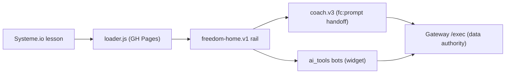

# 📊 Freedom Tracker (student rail) Dashboard

*Snapshot 2026-08-20 pm — refresh by invoking `/dave-core:dashboard` in this repo.*

> ✅ **2026-08-17 — nothing was ever outstanding: all five 2026-08-05 safety fixes have been live
> for students since 2026-08-05, 6:49pm Central.** The intervention doc's "Deployment state
> (honest, as of writing)" section was written at 3:28pm *while that session was still working*,
> and both commands it called permission-blocked ran the same evening — so the ⚠️ "2 live-channel
> promotes await one Dave command" that this dashboard carried for twelve days was describing a
> half-finished afternoon, not a real queue. **There is no command for Dave to run.** Measured
> three independent ways at $0: the registry's promote fingerprint (live and draft versions
> identical), the live channel's own first reply (names the symptoms back, carries the
> medical-supervision line), and prompt-token parity across channels (3620 == 3620 for
> byte-identical turns). A related worry is also retired as impossible: `publishShared` writes the
> shared rules as ONE object per channel, so a publish carries **all five rules or none** — the
> split this doc implied could never have existed, and two later write-ups spent effort narrowing
> a state that was never reachable.
>
> 🔒 **2026-08-17 — a live engine URL and an `at_` key were world-readable on GitHub Pages since
> 2026-07-18** (`fc7f4f2`, Fable). `test_home.html`'s `#freedom-home` stub carried them and Pages
> serves this repo publicly by design. Scrubbed — the stub now ships EMPTY like the live
> `/freedom/start` page, hand-filled locally when a live draft-bot mount is needed. Standing rules
> written into [CLAUDE.md](CLAUDE.md): the repo must stay public (Pages serves the live loaders),
> no live keys ever, and the loader `APP_KEY` is public by design so it is not the same class of
> thing.

**Mission:** the student-facing Freedom experience — tracker, AI coach, and the one-page **Freedom Home** rail (Dave's name: **Freedom Accelerator**) — served into Systeme.io lessons from GitHub Pages, grandpa-simple by doctrine.

## Headline

**Rounds 13 + 14 shipped 2026-07-21** — the program has its **third act**, end to end. Round 13: **More help & tools** (SYBR explainer with the quit-date answer + the named road, Power Hour revisits, direct tool opens), progress See↔Hide toggle, **Gateway default-project hardening** (Day-14 closed at account level), and the testability machinery (`fh preview`, the State Map below, doctrine §4.9). Round 14: **the milestone** — the Gateway watcher notices 3 logged days of Easy ≥7 + Enjoyable ≥7 and the rail raises the gold "⭐ Something worth seeing" card itself (grandpa never self-assesses); the **No-Brainer Life-Changing Decision room** (decide from ease; slips are rewiring material; two-second maintenance preview); deciding logs the milestone (registry JSON, works past the edit window), the ⭐ line **leads the progress story**, the card never returns, and the coach carries the decision as background context with slip-framing rules (never brings it up unprompted, never frames recurrence as failure — nothing resets). "Not yet" = 7-day snooze. Full journey + snooze + decided-state harness-verified; zero console errors. **Maintenance mode (tier 3) remains deliberately unbuilt** — designed after Dave's own milestone walk. **Round 15 (same day):** the page speaks a color language now — **gold = payoff** ("See my progress" joins the milestone family; blue = do, green = talk, gray = optional); desktop coach got its **"Your Freedom AI Coach"** identity back (hidden in the phone sheet where the bar says it); the explainer merged Dave's original SYBR-101 teaching devices (**3 named ingredients, the kiss proof, real-vs-imagined, bar-not-lake**) + Freedom Experiments with the 2-second example + time honesty + the **Freedom Proof Sprint** framing, and gained the **minplan revisit link** (the interactive teacher — 47 method mentions); **Withdrawal Helper** joined More-help with its medical-supervision safety line (was Day-1-only); the progress view teaches experiments in its **empty state** and names the **week-one proof** (Days 7–9: "You are not powerless"); Day 0 links the explainer its checkbox always presumed. **Round 16 (same day, off Dave's platform audit):** verdict — no unintended desktop/mobile divergence (his finds were state-dependent); the Gateway now branches per surface via `home:true` so **paste/tap mechanics language can never reach the Accelerator** (standalone lessons keep theirs); removal requests are legit ("their call, always" replace proposals); the chip family speaks ONE category language — **"Saving a rewiring opportunity…" → "Saved as a rewiring opportunity ✓ — 'their words'" → "Ask me anytime what's been challenging, and we'll pick a moment to rewire"** (own-words quotes untouchable); and the **wait-tip** turns the first model round trip into a planted seed ("…what would a two-second Freedom Experiment look like today?"). **🏁 v16 MILESTONE (Dave's call): the daily rhythm is solid — all four repos tagged `v16`.** **Round 17 (2026-07-21, the from-scratch chapter opens):** Dave's phone walk of create-project → wizard → Day 0 found two real defects, both diagnosed and fixed: **creation landed back on the old project** (three layers: client read `data.projectId` which the server never sent; the mock returned that wrong shape and hid it — §4.5's exact failure; and post-round-13 the server's own `activeProjectId` preferred the FINISHED project — this also silently broke loader.v7's create, healed by the same server fix) and **the haunted launcher** (picker blanked the DOM before `unmountTool()` could find the stub, so the old project's minimized tool bubble followed the student into the new wizard). **The structural change: Day 1 now starts when the student starts the Power Hour** — additive `day1Date` stamped by the first day-1 save (gated by `day1Pending`, set at wizard completion, so legacy projects keep their counting exactly); pre-start projects sit at "**Getting ready**" instead of drifting to Day N with no Power Hour done (Gateway @37, 19-case node proof incl. DST + zones). **Wizard rebuilt:** the "My Unwanted Behavior (UB)" context box with the student's own words on every step after the first, tap-to-change edits (stage never regresses), tap-to-fill moment chips, "Baseline saved ✓", tappable step-4 recap, "Getting you started…". **Day 0 rebuilt:** "Get ready for your Freedom Power Hour" (the checkbox nobody could honestly tick is gone; explains the hour, clear-headed line, tools-teach-you line; time-and-place receded to a collapsed optional; how-it-works link removed — Day 2+ keeps it). **Create is consent now** (rule 15 card; "Creating your new project…"; picker shows "New project (setting up)" then the student's words the moment step 1 saves). **New-project email opt-in** (Accelerator @9: `NEW_PROJECT_EMAIL` settings row, default OFF; template shrunk to Dave's three lines; welcome email untouched). **Doctrine rule 17 (new): authored copy wears human punctuation** — full student-string sweep across the rail, coach chips, widget note, explainer, milestone room (live AI replies exempt by Dave's boundary). All harness-verified end to end at 1280 + 375, zero console errors; live Gateway smoke clean. **Round 18 (same day, off Dave's round-17 live walk):** his real-account create FAILED silently (landed back on the old project, no new project anywhere) — root-cause chain: the registry write inside enrollment is best-effort-and-swallow (right for purchases with the backfill, wrong for in-app creates) AND round 17's server fallback dressed the failure as success. **Fixed as a class (doctrine §4.10):** the create response now carries the registration outcome end to end, the silent fallback is gone, and a failed create prints its reason + diagnostic detail on the consent card. Root-cause tail: the exact registry-write exception gets read via the new **diagnostics infrastructure** — read-only `adminDiag` on the Gateway (registry inspection, masked tokens) + `internal.diag` on the Accelerator (Activity Log tail, Master rows), own admin keys (off until set), local reader `freedom_tracker_gateway/tools/diag.js` with gitignored config (`.claspignore` added so tools/ can never leak into the GAS push). **Archive shipped** (Dave's green-light): goal-room "Archive this project" with rule-15 consequence copy, picker "Archived projects… (N)" restore room, Gateway archive/unarchive actions with a last-active-project guard — nothing is ever deleted, invisible to single-project accounts. **Tool sessions are project-scoped now** (`p<id>-` prefixed keys, rotation pointers, recency stamps): a second project can never resume the first project's conversations; legacy sessions are adopted (copied, never moved) by the account's oldest project so no one's history vanishes. Day-0 cosmetics from Dave's screenshot: full-width plan input, blue Save-my-plan. All harness-verified at 375 (archive round-trip, honest-error card with detail, p1 adoption + rotation + p2 isolation with real engine replies, cosmetics), zero console errors; Gateway @38, Accelerator @10, Pages pushed. **Round 18.1 (same evening, the diag tool's first real catch):** Dave armed the keys and `ac-activity` showed his 17:46 create had SUCCEEDED everywhere ("Gateway Register OK — Added project P6-W1", Master row 21) — the real culprit was the Gateway re-reading the registry in the SAME execution (stale spreadsheet snapshot) and then CACHING that stale list, hiding the new project until the TTL expired. Fix deployed (Accelerator @11, Gateway @39): the webhook returns the registered projectId, the create response is built from that truth on a diff-miss, and the registry cache is re-cleared so a stale snapshot can never outlive its request. Master row 21 / P6-W1 is a healthy blank project, not an orphan. **Round 19 (same night, Dave's second live grandpa walk — create/wizard/Day-0 all worked; polish round):** archive was UNDISCOVERABLE (he never thought to tap the goal line) and unreachable for blank projects (no goal line below stage 4) — the picker door is now a full **"Manage projects…" room**: every active project archives there (background archives stay in the room; archiving the current one lands on the default), every archived one restores, section heads + a current chip, readable at 10+ projects in a way the dropdown never was. Wizard: edit-mode "← Back (nothing changes)" free exit, every step scrolls to top (he was landing mid-page), the saved-note leads the page above the My-UB box and says "from step 2" (it read as step 3 being done), the anchor line emphasizes ***mindless*** + invites "Pick one, or write your own:", and a "Something else…" chip drops the cursor in the field. Day 0: a saved plan becomes the collapsed line itself — "I'll do it later. My plan: Wednesday morning… ›" — auto-collapsing on save (his "it doesn't look like I did anything" find; the mock now stores the plan like the real tracker). All harness-verified at 375, zero console errors, Pages pushed. **Round 20 (Dave's Power Hour walk — "thrown into the Willpower Eliminator" = a rule-5 fossil from the lesson-IS-the-tool era):** the Power Hour is now a **stepped page** in the daily rhythm's pattern language — five steps visible (4 tools + ★ scores), done steps collapse to ✓ rows, the current step is the one expanded card (tool name + one-line blurb + "Open my rewiring session →"), upcoming steps sit quiet (the map he reached for when tapping pips). Tools open on HIS tap only (phone auto-popup deleted), **fresh sessions preloaded** with the contract sentence ("I want to make it easier and more enjoyable to be free from: …") — **all four bots proven against the real engine** (NBWE asks one natural freedom-state follow-up; Minimalist Plan, Feel Good Start, and CJC go straight to work personalized); phones get a one-line minimize teach ("The – button at the top right brings you back anytime"); Day-0's start lands on the page, oriented; desktop mounts inline and hides the Open button; the scores form is the fifth step in place; the revisit picker keeps the single-tool view (explicit pick = invited). **Rename shipped** (Gateway @40): per-row Rename in the manage room with inline editor; a manual rename LOCKS the label so UB edits never clobber it — the picker says "Smoking" while the method keeps speaking "smoking like a fiend". Full walk verified both widths, zero console errors. **Picker-sync fix (2026-07-27, Dave's live coach-demo find — top dropdown on one project, embedded coach reading/writing another):** the rail and coach were two closures each holding a private `activeProjectId` with independent stores (rail: `ag_fh_pin_v1`; coach: the standalone tracker's `ag_ft_cache_v6`, else server default) and no bridge — a desync since the coach's round-10 birth, in both directions plus at boot after reload. Now ONE current project per page: the hosting surface is the store, announced via the `window.FREEDOM_PROJECT` global (late-booting embeds) + `fh:project` event (live re-scope) under a neutral `window.FREEDOM_PROJECT_HOST` flag; the coach mirrors, echoes its own dropdown back as `fc:project` (same switch path as the host's picker — tools and progress re-scope with it), and same-id guards terminate the echo. Coach gained a scope-generation guard: in-flight chat replies/help menus from the old project are discarded, never leaked into the new conversation. Boot seeds the coach from the host's announced project (wrong-project fast-paint skipped); create/archive/restore landings announce too (`adoptState`). **Same-evening extension (Dave's ask): the STANDALONE surface got the same fix** — loader.v7 is now the second announcing host (its `ft-project` dropdown, create landing, cache hydrate, and server adoption all announce; it listens for the coach's `fc:project` through the same extracted `switchProject_`), so a lesson page carrying both the standalone tracker and the standalone coach moves as one page too. The coach's sync is keyed to the neutral host flag and its `fh:project` listener registers unconditionally, so lesson-HTML script order can never disarm it; coach-only lessons (no host on the page) behave exactly as before. Harness ratchet: the coach stub had hard-pinned `activeProjectId:'1'` — the exact blindspot that let twenty rounds of walks miss this — it now echoes the requested project with per-project day/ub, and the rail mock serves per-project day/ub + snaps ghost pins like the real Gateway. Verified 1280 + 375 (sheet coach included): both directions, reload-with-pin, create landing, mid-flight race; zero console errors.

**Coach-sync round (2026-08-15, Fable — Dave's green light after his own Day-25 live walk):** the coach card's three seams closed. (1) The coach's project picker speaks the project's NAME — "Drinking Alcohol (Day 25)", label-first like both hosts — instead of its private "Project 4" ordinal (Dave read them as two different projects). (2) A transient Gateway failure on an activated device now gets an honest **"One moment" hiccup card** ("Your work is safe") with a working ↻ Try again plus ONE quiet self-retry; "Your access is still being set up" is reserved for a device with no token and no known projects — on Day 25 it read as "my project is gone". (3) **One refresh means the page**: the rail/tracker ↻ announces `fh:refresh` and the coach re-pulls; the coach's ↻ announces `fc:refresh` and the host re-pulls (listeners never re-dispatch, so the pair cannot loop; a live tool in the stub skips the host repaint; loader.v7 carries the same pair for standalone lessons). Plus fa_faster finding 1b: **direct daily opens preload like coach handoffs** — the contract sentence + the documented "No questions." fast-track lands as the student's first message in any session with no student turn, so the tool never re-asks the behavior stored since Day 0; resumes are untouched, and the round-12 reopen path keeps its empty prompt ON PURPOSE (only 2 of the findings' 3 sites were wired — the third is "reopen without re-sending" by design). Every state walked in both harnesses: exact preload text, both refresh directions with no loop, hiccup card held under double failure, Try-again heal, silent self-retry heal, multi-project labels. Tags `before-fable-2026-08-15` / `after-fable-2026-08-15`; revert = reset to the before tag.

**Porch round (2026-08-19, Fable — Dave's three-part front-porch dump, executed end to end):** the Manage room grew its third verb — **Reset to day one**, the STUDENT'S restart (never the system's: rule-16's no-streak-resets ban is untouched and now recorded in [DECISIONS.md](DECISIONS.md)). The card keeps the goal + rewiring moment, requires a fresh baseline (neutral wording when resetting a NON-active project — the walk caught it borrowing the active project's UB), links the archive-and-start-new alternative, and lands on a done-card whose **gold better-start line** appears only when the new baseline sum beats the old. Server side (Gateway **@42**): `resetProject` snapshots EVERYTHING into a **History tab** on the student's own sheet BEFORE any wipe (no snapshot, no wipe; pre-flight range check refuses pre-v6.3 trackers honestly), clears the logged days, writes the new baseline, restarts `day0` + arms `day1Pending` (post-reset lands on get-ready → Power Hour), and **re-stamps `type: ACCELERATOR`** — which quietly revives the old SPRINT-locked test projects (the "editing window has closed" corpses from Dave's porch walk: real ACCELERATOR students can never see that project-level lock). Client cleanup rotates out the project's tool sessions + caches. Chrome: the phone coach sheet's green bar is now a **breadcrumb — "Freedom Accelerator › AI coach"** — with the left name tappable (same as the dash), and tool popups carry the same pattern via the widget's new additive `data-crumb` attribute. Three-button manage rows **wrap** at 375. Harness-proven at 1280 + 375 (happy path + gold line, refusal lane with detail, crumb round-trip, both label lanes); live @42 probe: unauthenticated `resetProject` answers the auth wall, proving the action routes. Sibling ships same session: ai_tools engine @14 (scramble auto-retry; latency truth measured) + bh_rbf anti-parrot promoted live + porch-bench cards 1–3 differentiated.

**Teardown round (2026-08-19 evening, Fable — Dave's drunk-grandpa teardown of the porch build, all fixes shipped same day):** seven findings from his live phone walk, every one executed. (1) **The ↺ start-over re-personalizes** — the real defect of the walk: every preload rides `AgtWidget.send`, which the widget's internal restart can't see, so start-over landed on a bare greeting until the student happened to remount (his "for some reason it pre-populated again"). Every mount now hands the widget its lane's own fresh preload via the additive `data-restart-message-from` (daily lane keeps the "No questions" tail, PH/minplan lanes don't; Withdrawal stays bare — not preload-verified). (2) **"FA ›" on phones** — the widget's additive `data-crumb-short` collapses the popup crumb at ≤480px so the TOOL name owns the bar; the coach sheet and the rail keep the full name, which is what teaches the letters. (3) **Manage rows fold behind ONE Options button** (Dave's own design) — Rename / Reset / Archive drop in below the name, one row open at a time. (4) **The reset card defines the UB** — leads with "Your Unwanted Behavior (UB) that you want freedom from:" + his own words (active project only; label lane stays neutral), quotes the project name, and says out loud "You will start back with the Freedom Power Hour on day one. There is no undo for a reset to day one." Done-card grammar fixed ("starts fresh on day one"). (5) **Day-0 start answers the tap** — Day 1 is prefetched at render (rule 13) so the tap is instant, and the cold path shows "Starting your Freedom Power Hour…" instead of silence. (6) **The goal room's archive offer is GONE** — it ambushed his goal edit as a non-sequitur; Manage owns every lifecycle verb. (7) **"Archived ✓. Opening your next project…"** replaces the blank cut after archiving the current project. **Harness ratchet: test_home now runs a MOCK ENGINE** (`mock-engine` sentinel intercepted in the fetch stub, real-shape botMeta/chat envelopes, replies ECHO what the tool received) — so the REAL widget mounts offline and tool states (mounts, crumbs, preloads, ↺ restarts, session rotation) are walkable here for the first time; the empty-engine NOT_CONFIGURED blindspot hid every one of them. Whole walk harness-proven at 375 + 600, zero console errors. Doctrine: rule 34 (the tap answers instantly) added to DRUNK_GRANDPA_STRATEGY.md. Not touched on purpose: RBF pacing/"feels off" (Dave flagged it as a separate dig) and the reset mock's non-first-project Day-2 rule.

**Round 21 (2026-08-20, Fable — Dave's Eating Poorly V2 Power Hour walk: "the order is a recommendation, never a cage," executed on his open green light):** the Day-1 rail stopped forcing. **Every step row and every pip is a tappable door** — one card expands at a time (the router's pick when he hasn't tapped, so the follow-the-blue-buttons path is unchanged), out-of-order tool use is allowed, and the ✓ rows reopen: his exact oh-crap ("I finished this tool" tapped just to peek at tool 2, then no way back) now lands on "Done ✓ You can use this tool again anytime, as much as you want." with the session right there. **The ★ scores unlock at the FIRST tool, not the fourth** (his call: track scores once at least one tool ran) — the partial form carries "You can save them now… for the deepest rewiring, do all four", partial saves flip the ★ to ✓ by reading the day's OWN saved values (completion[1] still means the full four), and a saved ★ re-opens to a Saved ✓ card with the delta line when the review has one. **A receded skip door on Day 0 AND the rail** — gray link ("I want to skip the Freedom Power Hour" / "I'm done with my Power Hour for now"), a fold with the not-recommended case + comeback promise (+ a save-your-scores nudge only when it's true), and a confirm that stamps Day 1 via an EMPTY day-1 save (handleSave_ already stamps `day1Date` on any first day-1 save — zero Gateway changes), remembers the choice per-project on the pin, and lands on **"Skipped for now. Nothing is lost."** with one blue button back in; from Day 2 the daily rhythm wins regardless, cold-boot lands back on the skipped card, un-skip works from both Day-0 and Day-1 states, and a reset clears the flag (a reset revives, rule 33). When everything is finished the skip door becomes "← Back to my next step" and the celebrate card's pips walk back into any tool. **The UI-explainer lines are CUT** ("The tool fills your screen. The – button…" and the popup-mechanics intro) — the crumb teaches itself now that it's **bold full white** (widget `.agt-crumb` opacity 1/weight 700 — sibling ship in ai_tools — and the coach sheet's crumb white to match). Revisit views: an already-done tool's button reads "Done with this tool → back" instead of pretending to advance. Harness ratchets: **new `day1_partial` scenario**, the day-1 mock now ships saved after-PH scores in `scores.values` like the real readDay_, and **`.claude/static_server.js` + the `fh-harness` launch entry** serve the harness with the real widget in one verb. Whole walk harness-proven at 1280 + 375 (explore, out-of-order tick, done-reopen, ★ locked/partial/saved, skip/un-skip both days, cold boot, celebrate pips, crumb, preload echo), zero console errors. Doctrine: **rule 35** added to DRUNK_GRANDPA_STRATEGY.md; the decision record is [DECISIONS.md](DECISIONS.md) 2026-08-20. Dave's own "maybe that reset button is enough" verdict kept the per-card start-over OUT — the widget's ↺ already owns it.

**Round 22 (2026-08-20 pm, Fable — Dave's second walk of the round-21 build, full brain dump, "trust your intuition, create the plan and execute it"):** the end of Day 1 teaches tomorrow, and the day boundary stopped being a cage. **The Withdrawal Helper is step 5 on the Day-1 rail now** — "5 · Withdrawal Helper" quiet row + pip with a gray *optional* tag, expanding to "Tool 5: Withdrawal Helper (optional)" with the medical-supervision safety line (ships wherever the tool does, round 15); it mounts BARE (not preload-verified), its done-tick is a pure usage bookmark (`d1_withdrawal` — already `optionalCheck: true` in the Gateway's own day-1 spec, so **zero Gateway changes**), and the router never lands on it uninvited: `firstUntickedTool`, `phTickedCount_`, completion[1], the ★ unlock, and the skip-door phrasing all still mean the four core moves. "Tool {I} of 4" became "Tool {I}" (a Tool 5 beside an "of 4" would lie; the pips are the map). **The Minimalist Freedom Plan wears a blue "core daily plan" pill** (blue = do, rule 18) on its row and its card, and its blurb now says why: "From Day 2 on, that tiny plan is your core daily move" — the one tool the whole rhythm depends on is the one grandpa least skips. **Both Day-1 end cards (skipped AND celebrate) carry a "What happens next" card**: Day 2 starts tomorrow morning with the 30-second-to-2-minute rewiring at *their own saved moment*, the minplan-refresher promise, and the AI-coach + 7-to-22-minutes line — answering grandpa's "when does day 2 start, what exactly do I do?" out loud. No clock or timezone furniture on purpose: the day already rolls at the student's local midnight, so "tomorrow morning" is the whole honest answer. **And under both cards sits the receded early door** — "I want to start my daily rhythm early ›" → the not-recommended case → "Start my daily rhythm now →" (rule 35 crossing the DAY boundary: momentum is real, and someone scared and ready tonight is never told to wait for midnight). Confirming pins `phearly` per project (purely local — Day 1 is already stamped on both cards, so the tap answers in the same frame) and routes to **the early daily rail**: "An early start on your rhythm" + "Day 2 starts tomorrow morning. This is a head start, and nothing here is required today.", then ONE unnumbered "Talk it out, then rewire" card (the real coach + direct tool door), progress, More help, and "← Back to my Day 1 Power Hour" (clears early + skip, lands on the full rail). Steps 1 and 3 are deliberately absent — the morning rewiring has had no morning yet and Day 1's scores live in the ★ step, so rendering them would invite writes that fight the day-1 row. From Day 2 the flag is ignored (self-heals at midnight); a reset clears it (rule 33). Whole walk harness-proven at 1280 + 375 (wd expand/bare-mount/done/reopen, minplan tag, skip → next-steps → early → cold boot → back, celebrate lane, day5 + day1_partial regressions), zero console errors. Decision record: [DECISIONS.md](DECISIONS.md) 2026-08-20 round 22; doctrine rule 35's reference line extended.

## State board

| Lens | State | Where |
|---|---|---|
| Loader chain (v7 + #freedom-home route) | 🟢 live via Pages | [loader.v7.js](loader.v7.js) |
| Coach v3 (fc:prompt events, send-to-tool) | 🟢 built | [coach.v3.js](coach.v3.js) |
| Freedom Home one-page rail | 🟡 built + mock-harness green, awaiting live test | [freedom-home.v1.js](freedom-home.v1.js) |
| Mobile fullscreen takeover (9.8) | 🟢 **proven on Dave's iPhone** (2026-07-20); rounds 2–4 shipped same-day: tools popup fullscreen OVER the rail, minimized rail = hint card, one-bubble invariant, coach fullscreen sheet (round-4 fc-scroll fix: composer pinned, help never crushed) | [test_home_lesson.html](test_home_lesson.html) |
| Grandpa polish 9.9 (rounds 5–9) | 🟢 shipped 2026-07-20: rounds 5–8 (greeting experiments, handoff diet, goal box, day-rollover tz, one-line header) + round 9 (two-door coach — Recommend removed, "Target what's challenging today →" primary); provider outage resolved (Dave set AI_PROVIDER=openrouter) | plan doc 9.9 notes |
| **Round 10 — chrome + exclusivity + handoff revert** | 🟢 shipped 2026-07-20 evening, harness-verified desktop+375: solid "Freedom Accelerator" bar (floating – gone, labeled ↻ Refresh back), one-line goal box + step-1 "My moment", coach head de-duped ("Your Freedom AI Coach" sheet bar; Day · Refresh · picker line), chat hint = composer label, doors exclusive + "Start over with the freedom coach", coachHelpMenu **prefetched** (instant panel), warm greeting deleted (prompt lands visibly + "— no questions." tail, /fear/i-gated), step-1 get-help preloads minplan with the goal line on fresh sessions; **bh_rbf Screen-1 no-questions fast-track added in ai_tools (was promised in greeting, implemented nowhere) — proven in harness (Screen 2 skipped), promoted LIVE** | plan doc 9.9 round 10 |
| 9.7 polish (auto-log chips w/ undo, de-trackered copy) | 🟢 done | git log |
| Test harnesses | 🟢 in repo | [test_coach_home.html](test_coach_home.html) · [test_home.html](test_home.html) |
| **Stress test 2026-08 → Fable polish** — 6 personas vs the whole student path, then Dave's green light: fixes executed same day + RBF/F&A/Withdrawal deep-stressed (4 more live catches, fixed) | 🟢 shipped 2026-08-05, before/after boundary tagged (`before-fable-2026-08-05` / `after-fable-2026-08-05`, both repos); ✅ **2026-08-17: all five fixes measured LIVE** — the "2 live-channel promotes await one Dave command" note was stale from the day it was written, nothing is owed | [STRESS_TEST_2026-08.md](STRESS_TEST_2026-08.md) · [TOOL_DEEP_STRESS.md](stress_test_2026-08/TOOL_DEEP_STRESS.md) · [PLAN_fable_freedom_polish.md](PLAN_fable_freedom_polish.md) · [FABLE_INTERVENTION_2026-08-05.md](FABLE_INTERVENTION_2026-08-05.md) |

| 🗣 The re-ask defect (bots re-ask what the student already told them) | 🔴 **live on BOTH channels, deliberately NOT fixed** — the rule (`ASK ONLY WHAT'S MISSING`) is deployed and the model is disobeying it; a first fix was attempted under the review mandate and **reverted on evidence** (draft flow 0/8 vs live 8/8, and the medical-supervision line lost in 1 of 2 samples). A bot spec is a product change, so this is Dave's call, not a session's | [FABLE_INTERVENTION_2026-08-05.md](FABLE_INTERVENTION_2026-08-05.md) |

## Progress

**Done:** phases 5–9.8 + polish rounds 5–10 of the Freedom Home plan (shell, wizard, power-hour, daily, progress, coach persistence, session resume, auto-log chips, de-trackered voice, mobile fullscreen takeover, two-door coach, round-10 chrome/exclusivity/handoff).

- [ ] Phase 10 — Dave live test on a real lesson (now = walking round 10)
- [ ] Phase 11 — September model bump (scheduled; before Gemini 2.5-Flash's Oct 16 deprecation)

## ✍️ Waiting on Dave

0a. 🗣 **Your bots ask students two questions they already answered — do you want that fixed?** (2026-08-17) Found while measuring the live channel: on the first reply, both channels re-ask things the student's own opening sentence already said, and the bot's own state proves it heard them. The instruction telling them not to is already live; the model is ignoring it. **One attempt was made and pulled back** — the conditional-bullets wording stalled the screen advance entirely (0 of 8 vs 8 of 8 on the control) and dropped the medical-supervision safety line in one sample of two, so it was reverted and nothing live was ever touched. Editing a bot's script is a product change and the standing decision is that tools are never edited automatically, so this waits on your word. Leaving it costs a slightly clumsy first exchange, nothing unsafe.

0. **Live-verify the picker-sync fix** (the desync from your coach demo): open a Freedom Home lesson on your real account → switch the TOP project dropdown → the coach card's dropdown and Day line must follow within a beat; then switch the COACH's dropdown → the top dropdown, day chip, and goal line must follow. Reload the page: both must come back on the same project. (Pages cache ~10 min after push.) **Standalone too:** on any old-style lesson that shows the tracker AND the coach on one page, run the same two switches + reload — same expectation, one project everywhere.
1. ~~Gateway diag key~~ DONE — both diag channels verified live (the "Unauthorized." was diag.js missing the appKey, not Dave's paste; fixed). Claude reads registry + logs autonomously now.
2. **Your 5:46 create actually worked** — registry-confirmed: P6-W1 is active as "New project (setting up)". Use it for your next from-scratch walk, or archive it. New creates go straight to the wizard from here on. Bonus: old P1 is already archived in real data, so your live picker shows "Archived projects… (1)" today.
2b. 🚶 **Walk the round-22 build as drunk grandpa** (2026-08-20 pm, from your brain dump — Pages cache ~10 min after push): open Eating Poorly V2. What changed since this morning's walk: the Power Hour has a fifth row now, "5 · Withdrawal Helper" with a little gray *optional* tag (it opens like the others, and finishing it is never required). The Minimalist Freedom Plan row wears a small blue "core daily plan" pill so it stands out. When you tap "I'm done with my Power Hour for now", the skipped screen now has a "What happens next" card telling you Day 2 starts tomorrow morning, your own rewiring moment word for word, the refresher promise, and the 7-to-22-minutes line — and a quiet gray "I want to start my daily rhythm early ›" link under it. Tap that and you get a real early start: your AI coach tonight, one card, nothing required, with "← Back to my Day 1 Power Hour" underneath. The same next-steps card and early door sit under the Day-1 celebration screen too. Day 2 still unlocks on its own at your midnight, exactly as before.
3. **Try archive:** picker → Manage projects… → Options on any junk project → Archive; the Archived list's "Bring it back →" restores. (The goal-room archive control was REMOVED 2026-08-19 — your teardown caught it ambushing a goal edit; Manage owns all lifecycle verbs now.)
4. Round-17 walk items still open: wizard context-box edit + chips, Day-0 get-ready card, chip flip to Day 1 on the first tick. Your OLD projects keep legacy day counting (drinking-alcohol will read Day 1 tomorrow even unstarted — expected).
5. New-project email stays OFF (`NEW_PROJECT_EMAIL` = `on` in AI Settings re-enables). Email-coaching day-anchor requirement recorded in the plan doc.
6. If any wording looks old, check the Gateway **UI Copy tab** — sheet cells override code copy.

## 🗺 State Map — every conditional, its trigger, and how to summon it

*Run `fh preview` (desktop harness) or `fh preview phone` (fullscreen lesson) — the buttons across the top force scenarios; the seeds below force the rest. **Rule (doctrine §4.9): no conditional ships without a row here + a way to force it.***

| State | Trigger (real life) | What the student sees | Force it |
|---|---|---|---|
| Setup wizard | project setup stage < 4 | 4-step "Welcome! Let's set up" + the **My-UB context box** from step 2 (their words, tap to change) + moment chips on step 3 | `?s=wizard` (clear `ag_fh_pin_v1` first) |
| **Create-consent card** | pick "+ Start a new project" | "Start a new Freedom Accelerator project?" card; create button becomes "Creating your new project…"; cancel returns | `?s=multi` → pick + Start a new project |
| **New-project landing** | confirm create | lands IN the new project's wizard; picker reads "New project (setting up)" until step 1 saves their words into it | `?s=multi` → create |
| **Wizard change-my-answer** | tap the context box (steps 2–4) or a step-4 recap row | the matching step reopens prefilled with "Save my change →"; saving returns to where they were | `?s=wizard` → reach step 2 → tap the box |
| **Getting ready (pre-start)** | stage 4, Power Hour not started (`day1Date` absent) | day chip "Getting ready" + the "Get ready for your Freedom Power Hour" card (start button + collapsed time-and-place) | `?s=day0` |
| **Day-1 stamp flip** | first day-1 save on a pending project | chip flips Getting ready → Day 1 mid-walk; server stamps `day1Date` (legacy projects can never re-stamp) | `?s=day0` → start → tick tool 1 |
| **Create failure (honest)** | provisioning or registration fails server-side | the consent card STAYS with the reason + diagnostic detail in parentheses; button re-enables | `?s=multi&fail=create` → create |
| **Manage-projects room** | picker "Manage projects…" (>1 project or any archived) | Active list: name + ONE **Options** button per row (teardown 2026-08-19; the goal-room archive control is GONE — this room owns every lifecycle verb) + Archived list (Bring it back → lands ON it); background archives stay in the room | `?s=multi` → picker → Manage projects… |
| **Options fold (manage row)** | Options tapped on an active row | Rename / Reset / Archive drop in below the name (last active row shows no Archive); button flips to Close; opening one row closes the others | `?s=multi` → Manage projects… → Options |
| **Archive transition** | archiving the project on screen | "Archived ✓. Opening your next project…" replaces the generic loading cut | `?s=multi` → Options on the current row → Archive |
| **Wizard edit free exit** | tap the My-UB box or a recap row | "← Back (nothing changes)" under Save my change; instant local exit | `?s=wizard` → step 2 → tap the box |
| **Day-0 plan line (set)** | a saved time-and-place exists | collapsed line reads "I'll do it later. My plan: … ›" (word-truncated at 60); save auto-collapses into it | `?s=day0` → save a plan |
| **Legacy session adoption** | oldest project mounts a tool that has an unprefixed legacy session | conversation continues seamlessly under the new `p<id>-` key (copy, never move) | seed `ai_tools.v1.<bot>.draft.k<base>` in LS, mount on project 1 |
| **Cross-project session isolation** | any tool mount on a non-oldest project | fresh greeting, own `p<id>-` session; other projects' conversations unreachable | `?s=multi` → handoff on project 1, switch, handoff on project 2 |
| **Wizard guard retry** | wizard-shaped state on an account that ever finished setup, no explicit pick | loading shell → one `fresh=true` re-pull → wizard only if server insists twice | visit `?s=day5` (writes pin), then `?s=wizard`; mock log shows the double state call |
| Crossed-midnight fresh | cached snapshot from a previous local date | instant paint, then forced-fresh background refresh | edit `ag_fh_cache_v1`'s `today` to yesterday, reload |
| **Power Hour stepped rail** | currentDay ≤ 1, walk in progress | ONE page: pips + 5 step rows (✓ done / expanded current / quiet upcoming), open-on-tap with preloaded first message, phone minimize-teach line, scores form as step 5, then celebrate | `?s=day1_fresh` (fresh), `?s=day1_scores` (scores step) |
| **PH preload** | Open tapped on a fresh tool session | the contract sentence lands as the student's visible first message; the tool replies personalized (NBWE asks one freedom-state follow-up) | `?s=day1_fresh` → Open (real engine) |
| **Rename (manage room)** | Rename tapped on an active row | row swaps to inline editor; save locks the label against UB-driven writes | `?s=multi` → Manage projects… → Rename |
| Daily rail | day ≥ 2, stage 4 | the three-step rhythm | `?s=day5` |
| Resume button | today's session has a real student turn | "Continue where you left off with the {tool} →" | open a tool, send anything, reload |
| **Fresh-start ready card** | ready card while a live session exists | "Start a fresh rewiring session →" + wrap-up note; opening rotates the session key | use a tool, then run the guided flow |
| Back-to-session | any ready card after opening | live "Back to my rewiring session →" (never re-sends) | open any ready card |
| Conversation mode | student sent anything, no ready card | doors stand down, "Send a message…", Start-over shows | type to the coach |
| **Typed saving chips** | coach reply carries a save proposal | "Saving a rewiring opportunity…" → "Saved as a rewiring opportunity ✓ — 'their words'" + payoff + Undo (when restorable) | `?s=day5`, send a message containing "challenge" (700ms slowed save makes the verb visible) |
| **Wait-tip** | first model reply of a freshly mounted daily tool | muted line inside the typing bubble: "…two-second Freedom Experiment…"; gone on reply, never repeats | `?s=day5` → Simulate coach handoff (RBF) |
| Guided flow | "Target what's challenging today →" | composer hides, instant feelings panel (prefetched) | tap it |
| Ready-card end state | prompt built (either door) | card + See-or-edit + Start-over ONLY | finish the guided flow |
| Progress nudge | today not logged | "These numbers are from Day N — log today's…" | `?s=day9` → See my progress |
| Progress toggle (GOLD button) | tap | table + wins + **Freedom Experiments** + tell-your-coach line; label flips to "Hide my progress" | `?s=day9` |
| **Freedom Proof headline** | Days 7–9 with any positive movement | "That is your Freedom Proof… You are not powerless" leads the progress view | `?s=day9` |
| **Exps empty-state teach** | progress open, zero experiments logged | "try delaying your behavior even 2 seconds today" | `?s=day9` (day9 mock has no exps; `?s=milestone` has the full stack) |
| More help & tools | tap (ships collapsed) | explainer link, PH revisits, direct tools incl. **Withdrawal Helper** + medical-supervision safety line | any daily scenario |
| How-this-works card | link in More help (also on Day 0) | 2-min SYBR story (3 ingredients, kiss, real-vs-imagined, bar-not-lake) + Freedom Experiments + quit-date answer + Proof-Sprint road + ask-coach bridge + minplan revisit (Day 2+) | More help → the link |
| Fullscreen takeover / hint | phone width | "Freedom Accelerator" bar; minimized = hint card + bubble | `fh preview phone` |
| Coach sheet | phone, "Talk to your coach →" | fullscreen sheet, "Your Freedom AI Coach" bar | `fh preview phone` |
| Widget minimized note | tool popup minimized | "Your {tool} session is open — tap the blue chat bubble…" | phone: minimize an open tool |
| **Milestone card** | 3 most recent LOGGED score days all Easy ≥7 AND Enjoyable ≥7, no decision, not snoozed | gold "⭐ Something worth seeing" card between step 3 and progress; "Not yet" = 7-day snooze | `?s=milestone` |
| **Decision room + logged decision** | "Tell me about the No-Brainer Decision →" | decide-from-ease copy, slips-are-rewiring note, "I've made my decision" → saved; card never returns; ⭐ line leads the progress story; coach knows (background only) | `?s=milestone` → walk it; `?s=decided` = already-decided state |
| Setting-up poll | fresh buyer beat the webhook | "Setting up your tracker…" + auto-retry | `?s=settingup` |
| Multi-project picker | > 1 projects | dropdown in the one-line header | `?s=multi` |
| **Picker sync (rail ↔ coach)** | either project dropdown moves — or create/archive/restore lands somewhere new | the WHOLE page re-scopes together: day chip, goal line, top picker, coach picker + Day line; in-flight coach replies from the old project are discarded, never shown | `?s=multi` → switch either dropdown, watch the other follow (mock log prints both sides' scoped state calls); reload restores the same project on both |
| **Picker sync (STANDALONE tracker ↔ coach)** | same triggers on a standalone lesson page carrying loader.v7 + coach.v3 | both dropdowns + the coach Day line move together; reload restores one project on both (shared `ag_ft_cache_v6` + seed); create lands both on the new project | open `test_tracker_coach.html` (coach script loads FIRST on purpose — order must not matter) → switch either dropdown; reload; create |
| Gateway default pick (server) | state call with no projectId | finished project always beats a newer blank one | node-eval test in round-13 notes; blank never defaults |
| **Coach hiccup card** | a Gateway call fails for a student who already holds access (token or a known project list) | "One moment · I could not reach your project just now. Your work is safe." + ↻ Try again; ONE quiet self-retry ~4s later; the "being set up" card is reserved for a device with NO access | `test_coach_home.html` → wrap fetch to reject the next Gateway call → tap ↻ Refresh (reject TWICE to hold the card past the self-retry; Try again heals it) |
| **One refresh, whole page** | either ↻ tapped — the host header's or the coach Day line's | BOTH halves re-pull fresh: host announces `fh:refresh`, coach announces `fc:refresh`; listeners never re-dispatch (no loop); a live tool in the stub skips the host repaint | `?s=day5` → click either ↻; the mock log prints both sides' state calls |
| **Direct-lane preload** | a direct daily open (resume button / More-help) lands on a session with NO student turn | the contract sentence + " Let's start rewiring immediately. No questions." arrives as their visible first message — the tool skips its digging exactly like a coach handoff; resumes stay untouched (no rotation, no hint line); the round-12 reopen path stays empty by design | `?s=day5` → stub `window.AgtWidget` with a recorder, click the direct button, read the recorded send |
| **Reset card (manage room)** | Options → Reset on an active row (2026-08-19; teardown copy same day) | leads with "Your Unwanted Behavior (UB) that you want freedom from:" + the student's own UB words in a quiet box (ACTIVE project only — other rows get the quoted label + neutral "this behavior" wording; a privacy-placeholder UB is never echoed), then the quoted-label body, the "start back with the Freedom Power Hour… no undo" line, REQUIRED fresh baseline, archive-alternative link | `?s=multi` → Manage projects… → Options → Reset (current row = UB box; other row = neutral lane) |
| **Reset done card** | reset succeeds | "Reset done. Day one is ready." + GOLD better-start line only when the new baseline sum beats the old; "Take me there →" cleans the project's tool sessions and lands on it | same walk, scores 5/4/6 vs mock old 2/1/3 |
| **Reset refused (older format)** | the tracker lacks v6.3 daily ranges | honest refusal naming the archive-and-start-new path, with the missing-ranges detail | `?s=multi&fail=reset` |
| **D0 start feedback** | tapping "Start my Freedom Power Hour…" before the render-time Day-1 prefetch lands (slow network only) | button disables and reads "Starting your Freedom Power Hour…" — never a silent tap (teardown 2026-08-19); the prefetch makes the normal tap INSTANT | mock is instant, so the label is unforceable here — throttle the network, or trust the prefetch walk: `?s=day0` → start lands on the Power Hour page synchronously |
| **Tool ↺ restart preload** | ↺ Start-over inside any preload-verified tool (4 Power Hour bots + RBF/F&A; Withdrawal restarts bare) | fresh session opens ALREADY personalized — the lane's own preload re-sends as the first message (daily lane carries the "No questions" tail, PH/minplan lanes don't) | `?s=multi` → open the daily tool → ↺ → confirm; the mock engine echoes what it received (mock-log shows 2 engine calls) |
| **FA crumb (phone)** | any tool popup ≤480px wide | bar reads "FA › {tool name}" — the tool name gets the space; >480px and the coach sheet keep "Freedom Accelerator", which teaches the letters; tapping either form minimizes | `?s=multi` → open a tool at 375 (FA) then at 600 (full name) |
| **Coach sheet crumb** | the phone coach sheet is open (2026-08-19) | green bar reads "Freedom Accelerator › AI coach"; tapping the underlined left name minimizes, same as the dash — white + bold since round 21 (a faded crumb reads as furniture) | mobile width → Talk to your coach → tap the crumb |
| **PH explore (round 21)** | any quiet step row or pip tapped on the Day-1 rail | THAT card expands (one at a time); no tap = the router's pick, so the guided path looks unchanged; out-of-order "I finished this tool" ticks land and the router re-guides to the first unticked | `?s=day1_fresh` → tap pip 3 or the "3 · Feel Good Start" row |
| **PH done-tool reopen** | a ✓ row or ✓ pip tapped | "Done ✓ You can use this tool again anytime, as much as you want." + Open/Continue; NO done button (the tick is a bookmark, never a lock) | `?s=day1_partial` → tap "✓ No-Brainer…" (or tick one out of order in day1_fresh first) |
| **★ locked (0 tools)** | scores row tapped before any tool tick | "Your scores unlock after your first tool…" — no form | `?s=day1_fresh` → tap the ★ row |
| **★ partial (1–3 tools)** | scores row tapped with ≥1 tick, none saved | the form + "You can save them now… for the deepest rewiring, do all four"; saving flips ★→✓ and the router expands the next unticked tool | `?s=day1_partial` → tap ★ → save 7/6/8 |
| **★ saved card** | scores row tapped after a save | "Saved ✓ You'll see your movement any time in your progress." + the delta line when the review has one | same walk → tap the ✓ scores row |
| **PH skip door** | the gray link under the rail (or on the Day-0 card) | fold with the not-recommended case + comeback promise; ≥1 tool flips the wording to "I'm done with my Power Hour for now" and adds the save-your-scores nudge only while scores are unsaved; confirm stamps Day 1 (empty day-1 save) + pins the choice | `?s=day0` or `?s=day1_fresh` → tap the link → confirm |
| **PH skipped card** | skip confirmed, still Day 0/1 | "Skipped for now. Nothing is lost." + one blue button back in; cold boot lands here too; un-skip clears the pin flag and routes (Day-0 state returns to get-ready); Day 2+ ignores the flag (daily wins); reset clears it | skip in any Day-0/1 scenario, reload to prove the cold boot |
| **PH all-done back link** | rail opened from the celebrate card's pips with everything finished | the skip door is replaced by "← Back to my next step" → celebrate | `?s=day1_scores` → save scores → tap any pip → tap the back link |
| **PH revisit done-label** | single-tool revisit of an already-ticked tool | button reads "Done with this tool → back" instead of "I finished this tool → Continue" | `?s=day1_scores` → celebrate → Revisit a Power Hour tool → pick any |
| **PH withdrawal step (round 22)** | the Day-1 rail, always | "5 · Withdrawal Helper" quiet row + pip, gray *optional* tag; tapping expands "Tool 5: Withdrawal Helper (optional)" with the safety line; mounts BARE (no preload — the mock log shows no engine echo on open); done → ✓ bookmark that reopens; the router never lands here on its own | `?s=day1_fresh` → tap the "5 ·" row or the 5 pip |
| **Minplan core tag (round 22)** | the Day-1 rail, always | blue "core daily plan" pill on the "2 ·" row and the expanded Tool 2 card; blurb ends "From Day 2 on, that tiny plan is your core daily move." | `?s=day1_fresh` |
| **What-happens-next card (round 22)** | either Day-1 end card (skipped or celebrate) | "What happens next": Day 2 tomorrow morning + the student's saved moment, the minplan refresher line, the coach + 7-to-22-minutes line | skip in `?s=day1_fresh`, or `?s=day1_scores` → save scores |
| **Early-rhythm door (round 22)** | gray link under either end card | fold with the not-recommended case + "Start my daily rhythm now →"; confirming pins `phearly` per project, no server call (Day 1 already stamped) | same walks → "I want to start my daily rhythm early ›" |
| **Early daily rail (round 22)** | currentDay 1 + the `phearly` pin flag | "An early start on your rhythm" + head-start sub; ONE unnumbered talk card (coach + direct tool), progress, More help, "← Back to my Day 1 Power Hour" (clears early + skip); steps 1 and 3 absent; cold boot lands here; Day 2+ ignores the flag; reset clears it | confirm the early door, then reload to prove the cold boot |

## 🔌 Connections

| Surface | Detail |
|---|---|
| Hosting | GitHub Pages (this repo) — Pages cache ~10 min after `gc` push |
| Embedded in | Systeme.io lessons (Freedom course) |
| Data authority | [freedom_tracker_gateway](https://github.com/dfonvielle/freedom_tracker_gateway) /exec |
| Bots | [ai_tools](https://github.com/dfonvielle/ai_tools) via the public widget |
| Data | all student data lives in the [Gateway's](https://github.com/dfonvielle/freedom_tracker_gateway) authority sheet — this repo touches no spreadsheet directly |
| Google Apps Script | **none — verified 2026-07-20** (zero GAS code; pure browser JS calling the Gateway's /exec) |

## 🤖 AI leverage

*Seeded from the 2026-07-19 fresh-eyes burn ([opus](https://github.com/dfonvielle/mission_control/blob/main/ai_research/fresh_eyes/freedom-tracker_opus.md) · [gpt-4.1](https://github.com/dfonvielle/mission_control/blob/main/ai_research/fresh_eyes/freedom-tracker_gpt41.md)).*

- **End-of-session reflection reframes:** raw log → 2-sentence "here's what you actually accomplished" — turns friction logging into dopamine.
- **Withdrawal-helper triage:** classify severity of a struggle flag, suggest ONE playbook action — coaching-adjacent without Dave present.
- **Weekly digest:** a week of sessions → narrative momentum email; retention hook that writes itself.

## 📚 Library

Plan: [PLAN_freedom_home_and_providers.md](https://github.com/dfonvielle/mission_control/blob/main/plans/PLAN_freedom_home_and_providers.md) · doctrine: [DRUNK_GRANDPA_STRATEGY.md](https://github.com/dfonvielle/mission_control/blob/main/DRUNK_GRANDPA_STRATEGY.md) (both moved into mission_control 2026-07-29 so they are versioned and backed up; the old `coding_projects/` root paths are symlinks and still work) · coach eval journeys: [gateway ai_research](https://github.com/dfonvielle/freedom_tracker_gateway/tree/main/ai_research)

*🚀 Part of [Mission Control](https://github.com/dfonvielle/mission_control/blob/main/DASHBOARD.md) — the all-projects dashboard.*
