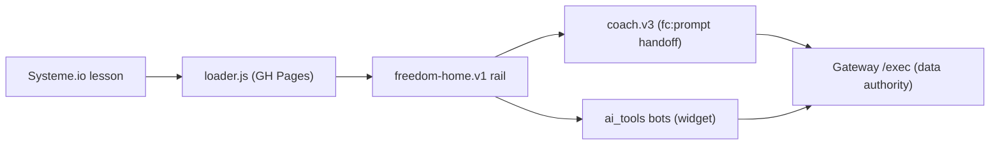

# 📊 Freedom Tracker (student rail) Dashboard

*Snapshot 2026-07-21 (round 13) — refresh by invoking `/dave-core:dashboard` in this repo.*

**Mission:** the student-facing Freedom experience — tracker, AI coach, and the one-page **Freedom Home** rail (Dave's name: **Freedom Accelerator**) — served into Systeme.io lessons from GitHub Pages, grandpa-simple by doctrine.

## Headline

**Round 13 shipped 2026-07-21** — the program's **third act enters the product** (tier 1) + the conditionals become forgettable-proof. New: **More help & tools** (one closed door at the rail bottom: the SYBR explainer, Power Hour revisits with once-is-all-it-takes framing, direct RBF/F&A opens), the **"How this rewiring works" card** (prediction errors, the smiley-face-with-magnifying-glass move, the quit-date answer — "a fight that stopped existing" — and the named road ending in "this page is designed to make itself unnecessary", with an ask-your-coach bridge), **progress toggle** (See ↔ Hide, cache-instant), **Gateway default-project hardening** (a finished project always beats a newer blank one — the Day-14 flash closed at ACCOUNT level; node-proven), and the **testability machinery**: `fh preview [phone]` command, the **State Map** below (21 conditionals: trigger + what shows + how to force), doctrine §4.9 (no conditional without a forcing scenario). Round 14 designed and constitutionally constrained (milestone watcher, logged No-Brainer Decision, slips-are-a-feature, no streaks/lockouts/demotions ever) — builds after Dave's own milestone walk. Next: **Dave's round-13 walk + `fh preview`**, then humans.

## State board

| Lens | State | Where |
|---|---|---|
| Loader chain (v7 + #freedom-home route) | 🟢 live via Pages | [loader.v7.js](loader.v7.js) |
| Coach v3 (fc:prompt events, send-to-tool) | 🟢 built | [coach.v3.js](coach.v3.js) |
| Freedom Home one-page rail | 🟡 built + mock-harness green, awaiting live test | [freedom-home.v1.js](freedom-home.v1.js) |
| Mobile fullscreen takeover (9.8) | 🟢 **proven on Dave's iPhone** (2026-07-20); rounds 2–4 shipped same-day: tools popup fullscreen OVER the rail, minimized rail = hint card, one-bubble invariant, coach fullscreen sheet (round-4 fc-scroll fix: composer pinned, help never crushed) | [test_home_lesson.html](test_home_lesson.html) |
| Grandpa polish 9.9 (rounds 5–9) | 🟢 shipped 2026-07-20: rounds 5–8 (greeting experiments, handoff diet, goal box, day-rollover tz, one-line header) + round 9 (two-door coach — Recommend removed, "Target what's challenging today →" primary); provider outage resolved (Dave set AI_PROVIDER=openrouter) | plan doc 9.9 notes |
| **Round 10 — chrome + exclusivity + handoff revert** | 🟢 shipped 2026-07-20 evening, harness-verified desktop+375: solid "Freedom Accelerator" bar (floating – gone, labeled ↻ Refresh back), one-line goal box + step-1 "My moment", coach head de-duped ("Your Freedom AI Coach" sheet bar; Day · Refresh · picker line), chat hint = composer label, doors exclusive + "Start over with the freedom coach", coachHelpMenu **prefetched** (instant panel), warm greeting deleted (prompt lands visibly + "— no questions." tail, /fear/i-gated), step-1 get-help preloads minplan with the goal line on fresh sessions; **bh_rbf Screen-1 no-questions fast-track added in ai_tools (was promised in greeting, implemented nowhere) — proven in harness (Screen 2 skipped), promoted LIVE** | plan doc 9.9 round 10 |
| 9.7 polish (auto-log chips w/ undo, de-trackered copy) | 🟢 done | git log |
| Test harnesses | 🟢 in repo | [test_coach_home.html](test_coach_home.html) · [test_home.html](test_home.html) |

## Progress

**Done:** phases 5–9.8 + polish rounds 5–10 of the Freedom Home plan (shell, wizard, power-hour, daily, progress, coach persistence, session resume, auto-log chips, de-trackered voice, mobile fullscreen takeover, two-door coach, round-10 chrome/exclusivity/handoff).

- [ ] Phase 10 — Dave live test on a real lesson (now = walking round 10)
- [ ] Phase 11 — September model bump (scheduled; before Gemini 2.5-Flash's Oct 16 deprecation)

## ✍️ Waiting on Dave

1. **Walk round 13 live** (Pages ~10 min; hard-refresh): the progress toggle, **More help & tools** at the bottom (explainer → read it as YOUR method voice and flag any wording to change; PH revisits; direct tools), and the ask-your-coach bridge at the end of the explainer.
2. **Try `fh preview`** in Terminal (and `fh preview phone`) — the scenario buttons force any conditional state; the **State Map** below is the full inventory.
3. Blank-project check is now optional curiosity: the Gateway default hardening makes a stray blank project harmless (a finished project always wins the default). Delete it if you see it; nothing depends on it.
4. If any wording looks old, check the Gateway **UI Copy tab** — sheet cells override code copy; clear stale cells.

## 🗺 State Map — every conditional, its trigger, and how to summon it

*Run `fh preview` (desktop harness) or `fh preview phone` (fullscreen lesson) — the buttons across the top force scenarios; the seeds below force the rest. **Rule (doctrine §4.9): no conditional ships without a row here + a way to force it.***

| State | Trigger (real life) | What the student sees | Force it |
|---|---|---|---|
| Setup wizard | project setup stage < 4 | 4-step "Welcome! Let's set up" | `?s=wizard` (clear `ag_fh_pin_v1` first) |
| **Wizard guard retry** | wizard-shaped state on an account that ever finished setup, no explicit pick | loading shell → one `fresh=true` re-pull → wizard only if server insists twice | visit `?s=day5` (writes pin), then `?s=wizard`; mock log shows the double state call |
| Crossed-midnight fresh | cached snapshot from a previous local date | instant paint, then forced-fresh background refresh | edit `ag_fh_cache_v1`'s `today` to yesterday, reload |
| Day 0 / Power Hour / Day-1 done | currentDay ≤ 1 | PH sequence, pips, celebrate | `?s=day1_fresh`, `?s=day1_scores` |
| Daily rail | day ≥ 2, stage 4 | the three-step rhythm | `?s=day5` |
| Resume button | today's session has a real student turn | "Continue where you left off with the {tool} →" | open a tool, send anything, reload |
| **Fresh-start ready card** | ready card while a live session exists | "Start a fresh rewiring session →" + wrap-up note; opening rotates the session key | use a tool, then run the guided flow |
| Back-to-session | any ready card after opening | live "Back to my rewiring session →" (never re-sends) | open any ready card |
| Conversation mode | student sent anything, no ready card | doors stand down, "Send a message…", Start-over shows | type to the coach |
| Guided flow | "Target what's challenging today →" | composer hides, instant feelings panel (prefetched) | tap it |
| Ready-card end state | prompt built (either door) | card + See-or-edit + Start-over ONLY | finish the guided flow |
| Progress nudge | today not logged | "These numbers are from Day N — log today's…" | `?s=day9` → See my progress |
| Progress toggle | tap | table + wins + **Freedom Experiments** + tell-your-coach line; label flips to "Hide my progress" | `?s=day9` |
| More help & tools | tap (ships collapsed) | explainer link, PH revisits, direct tool opens | any daily scenario |
| How-this-works card | link in More help | SYBR story + quit-date answer + the road + ask-your-coach bridge | More help → the link |
| Fullscreen takeover / hint | phone width | "Freedom Accelerator" bar; minimized = hint card + bubble | `fh preview phone` |
| Coach sheet | phone, "Talk to your coach →" | fullscreen sheet, "Your Freedom AI Coach" bar | `fh preview phone` |
| Widget minimized note | tool popup minimized | "Your {tool} session is open — tap the blue chat bubble…" | phone: minimize an open tool |
| Setting-up poll | fresh buyer beat the webhook | "Setting up your tracker…" + auto-retry | `?s=settingup` |
| Multi-project picker | > 1 projects | dropdown in the one-line header | `?s=multi` |
| Gateway default pick (server) | state call with no projectId | finished project always beats a newer blank one | node-eval test in round-13 notes; blank never defaults |

## 🔌 Connections

| Surface | Detail |
|---|---|
| Hosting | GitHub Pages (this repo) — Pages cache ~10 min after `gc` push |
| Embedded in | Systeme.io lessons (Freedom course) |
| Data authority | [freedom_tracker_gateway](https://github.com/dfonvielle/freedom_tracker_gateway) /exec |
| Bots | [ai_tools](https://github.com/dfonvielle/ai_tools) via the public widget |
| Data | all student data lives in the [Gateway's](https://github.com/dfonvielle/freedom_tracker_gateway) authority sheet — this repo touches no spreadsheet directly |
| Google Apps Script | **none — verified 2026-07-20** (zero GAS code; pure browser JS calling the Gateway's /exec) |

## 🤖 AI leverage

*Seeded from the 2026-07-19 fresh-eyes burn ([opus](https://github.com/dfonvielle/mission_control/blob/main/ai_research/fresh_eyes/freedom-tracker_opus.md) · [gpt-4.1](https://github.com/dfonvielle/mission_control/blob/main/ai_research/fresh_eyes/freedom-tracker_gpt41.md)).*

- **End-of-session reflection reframes:** raw log → 2-sentence "here's what you actually accomplished" — turns friction logging into dopamine.
- **Withdrawal-helper triage:** classify severity of a struggle flag, suggest ONE playbook action — coaching-adjacent without Dave present.
- **Weekly digest:** a week of sessions → narrative momentum email; retention hook that writes itself.

## 📚 Library

Plan: `~/Desktop/coding_projects/PLAN_freedom_home_and_providers.md` (local — coding_projects root is not a repo) · doctrine: `~/Desktop/coding_projects/DRUNK_GRANDPA_STRATEGY.md` (local) · coach eval journeys: [gateway ai_research](https://github.com/dfonvielle/freedom_tracker_gateway/tree/main/ai_research)

*🚀 Part of [Mission Control](https://github.com/dfonvielle/mission_control/blob/main/DASHBOARD.md) — the all-projects dashboard.*
