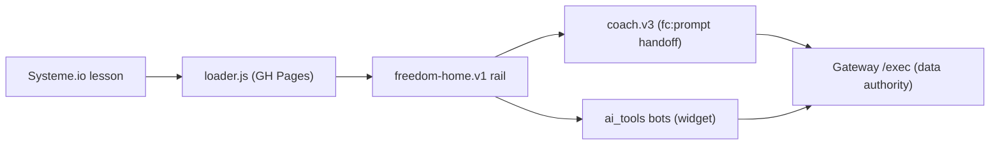

# 📊 Freedom Tracker (student rail) Dashboard

*Snapshot 2026-07-20 (round 10) — refresh by invoking `/dave-core:dashboard` in this repo.*

**Mission:** the student-facing Freedom experience — tracker, AI coach, and the one-page **Freedom Home** rail (Dave's name: **Freedom Accelerator**) — served into Systeme.io lessons from GitHub Pages, grandpa-simple by doctrine.

## Headline

**Round 10 shipped 2026-07-20 evening** — chrome unification (the fullscreen rail now wears the same solid **"Freedom Accelerator" bar + minimizer** as the tool popups/coach sheet), two-door **path exclusivity** (guided flow hides the composer; a ready card hides both doors + offers "Start over"), **instant** guided panel (coachHelpMenu prefetched at boot), the round-5 warm-greeting handoff **reverted** (tool greets normally, prompt lands visibly, tail "Let's start rewiring immediately — no questions"), and the RBF bot's **promised-but-unimplemented no-questions skip actually implemented** (bh_rbf Screen-1 fast-track; draft-proven then LIVE). Next milestone: **Dave's live phone + desktop walkthrough of round 10** (plan phase 10).

## State board

| Lens | State | Where |
|---|---|---|
| Loader chain (v7 + #freedom-home route) | 🟢 live via Pages | [loader.v7.js](loader.v7.js) |
| Coach v3 (fc:prompt events, send-to-tool) | 🟢 built | [coach.v3.js](coach.v3.js) |
| Freedom Home one-page rail | 🟡 built + mock-harness green, awaiting live test | [freedom-home.v1.js](freedom-home.v1.js) |
| Mobile fullscreen takeover (9.8) | 🟢 **proven on Dave's iPhone** (2026-07-20); rounds 2–4 shipped same-day: tools popup fullscreen OVER the rail, minimized rail = hint card, one-bubble invariant, coach fullscreen sheet (round-4 fc-scroll fix: composer pinned, help never crushed) | [test_home_lesson.html](test_home_lesson.html) |
| Grandpa polish 9.9 (rounds 5–9) | 🟢 shipped 2026-07-20: rounds 5–8 (greeting experiments, handoff diet, goal box, day-rollover tz, one-line header) + round 9 (two-door coach — Recommend removed, "Target what's challenging today →" primary); provider outage resolved (Dave set AI_PROVIDER=openrouter) | plan doc 9.9 notes |
| **Round 10 — chrome + exclusivity + handoff revert** | 🟢 shipped 2026-07-20 evening, harness-verified desktop+375: solid "Freedom Accelerator" bar (floating – gone, labeled ↻ Refresh back), one-line goal box + step-1 "My moment", coach head de-duped ("Your Freedom AI Coach" sheet bar; Day · Refresh · picker line), chat hint = composer label, doors exclusive + "Start over with the freedom coach", coachHelpMenu **prefetched** (instant panel), warm greeting deleted (prompt lands visibly + "— no questions." tail, /fear/i-gated), step-1 get-help preloads minplan with the goal line on fresh sessions; **bh_rbf Screen-1 no-questions fast-track added in ai_tools (was promised in greeting, implemented nowhere) — proven in harness (Screen 2 skipped), promoted LIVE** | plan doc 9.9 round 10 |
| 9.7 polish (auto-log chips w/ undo, de-trackered copy) | 🟢 done | git log |
| Test harnesses | 🟢 in repo | [test_coach_home.html](test_coach_home.html) · [test_home.html](test_home.html) |

## Progress

**Done:** phases 5–9.8 + polish rounds 5–10 of the Freedom Home plan (shell, wizard, power-hour, daily, progress, coach persistence, session resume, auto-log chips, de-trackered voice, mobile fullscreen takeover, two-door coach, round-10 chrome/exclusivity/handoff).

- [ ] Phase 10 — Dave live test on a real lesson (now = walking round 10)
- [ ] Phase 11 — September model bump (scheduled; before Gemini 2.5-Flash's Oct 16 deprecation)

## ✍️ Waiting on Dave

1. **Walk round 10 live** — phone + desktop on the real lesson (Pages cache ~10 min after this push; hard-refresh). Watch for: the Freedom Accelerator bar, instant "Target…" panel, ready-card-only end state, handoff jumping STRAIGHT to rewiring (no digging screen), "Get help with this" answering instead of asking.
2. If the coach's wording looks old anywhere, check the Gateway **UI Copy tab** — sheet cells override code copy (CHAT_HINT etc.); clear stale cells.

## 🔌 Connections

| Surface | Detail |
|---|---|
| Hosting | GitHub Pages (this repo) — Pages cache ~10 min after `gc` push |
| Embedded in | Systeme.io lessons (Freedom course) |
| Data authority | [freedom_tracker_gateway](https://github.com/dfonvielle/freedom_tracker_gateway) /exec |
| Bots | [ai_tools](https://github.com/dfonvielle/ai_tools) via the public widget |
| Data | all student data lives in the [Gateway's](https://github.com/dfonvielle/freedom_tracker_gateway) authority sheet — this repo touches no spreadsheet directly |
| Google Apps Script | **none — verified 2026-07-20** (zero GAS code; pure browser JS calling the Gateway's /exec) |

## 🤖 AI leverage

*Seeded from the 2026-07-19 fresh-eyes burn ([opus](https://github.com/dfonvielle/mission_control/blob/main/ai_research/fresh_eyes/freedom-tracker_opus.md) · [gpt-4.1](https://github.com/dfonvielle/mission_control/blob/main/ai_research/fresh_eyes/freedom-tracker_gpt41.md)).*

- **End-of-session reflection reframes:** raw log → 2-sentence "here's what you actually accomplished" — turns friction logging into dopamine.
- **Withdrawal-helper triage:** classify severity of a struggle flag, suggest ONE playbook action — coaching-adjacent without Dave present.
- **Weekly digest:** a week of sessions → narrative momentum email; retention hook that writes itself.

## 📚 Library

Plan: `~/Desktop/coding_projects/PLAN_freedom_home_and_providers.md` (local — coding_projects root is not a repo) · doctrine: `~/Desktop/coding_projects/DRUNK_GRANDPA_STRATEGY.md` (local) · coach eval journeys: [gateway ai_research](https://github.com/dfonvielle/freedom_tracker_gateway/tree/main/ai_research)

*🚀 Part of [Mission Control](https://github.com/dfonvielle/mission_control/blob/main/DASHBOARD.md) — the all-projects dashboard.*
